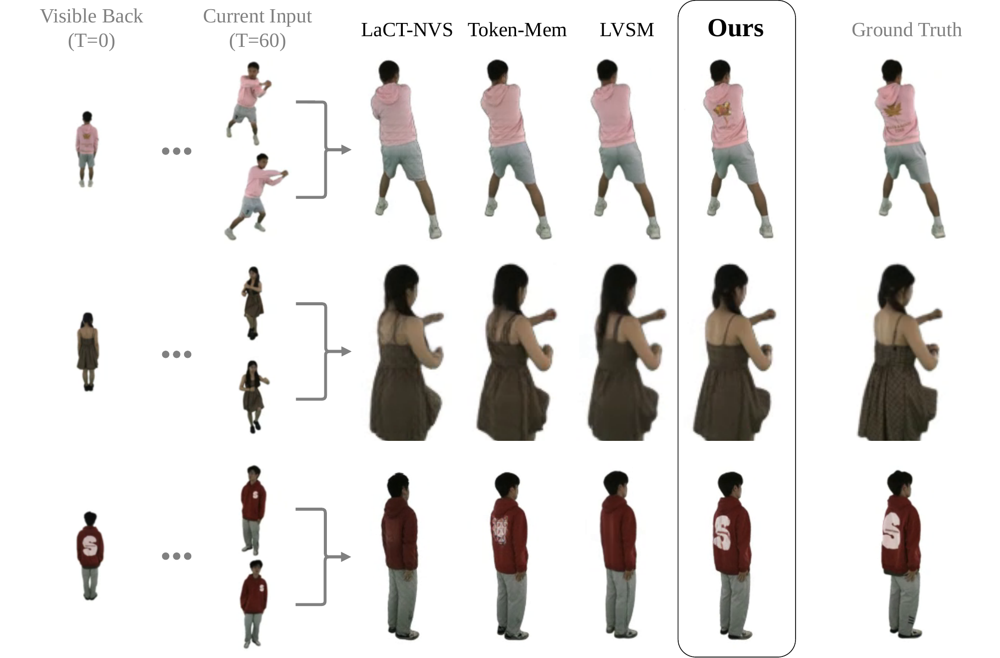

# AGENTS.md — NSTM Project Website

> **What is this?** Developer documentation for the Neural Space-Time Memory supplementary website.
> For paper content and details, see [`resources/main_paper.pdf`](resources/main_paper.pdf).
> For visual direction, see [`docs/design_guidelines.md`](docs/design_guidelines.md).

---

## 1. Project Overview

This is a **static, offline-capable** academic project page for the NSTM paper (WACV 2027, anonymous submission #707). It showcases supplementary materials — videos, figures, ablations, and interactive comparisons.

**Key constraints:**
- **No build step.** Double-clicking `index.html` must work.
- **No external requests.** All CSS, fonts, and assets are bundled locally.
- **Portable.** The entire directory is zipped and submitted as supplemental evidence.

---

## 2. Architecture

### How sections are assembled

Each section lives in its own file inside `sections/`. A **build script** (`build.sh`) concatenates them into a single `index.html`. This ensures the page works when double-clicked via `file://` protocol (browser CORS policy blocks runtime JS `fetch`/`XHR` on local files).

```bash
# After editing any section file, rebuild:
bash build.sh
```

The script reads the sections in order, wraps them with the `<head>` and footer, and writes `index.html`. **Do not edit `index.html` directly** — edit the section files and rebuild.

### File tree

```
nstm_website/
├── index.html              ← assembled output (do not edit directly)
├── build.sh                ← assembles index.html from sections (dev-only)
├── styles.css              ← global design tokens & Bulma overrides
├── data-gallery.css        ← data gallery styles (separate from styles.css)
├── js/
│   ├── gallery-carousel.js ← zero-dependency figure carousel (transform-based)
│   ├── video-player.js     ← visual results video player logic
│   └── data-gallery.js     ← reusable data gallery component (lazy load, lightbox, filters)
├── vendor/
│   ├── bulma/
│   │   └── bulma.min.css   ← Bulma 0.9.4 (bundled)
│   └── fonts/
│       ├── inter-regular.woff2
│       ├── inter-medium.woff2
│       └── inter-bold.woff2
├── sections/               ← one file per page section (dev-only, consumed by build.sh)
│   ├── title.html
│   ├── links.html
│   ├── hero-demo.html
│   ├── abstract.html
│   ├── visual-results.html
│   ├── overview-graph.html
│   ├── figures.html
│   ├── ablation.html
│   ├── additional-results.html ← Natural Rotations figure/table + inference perf
│   ├── gallery-links.html  ← footer links to the four data gallery pages
│   └── supplementary-pdf.html
├── gallery.html            ← data gallery landing page (links to 4 sub-galleries)
├── gallery-nvs.html        ← General NVS Results gallery
├── gallery-ablations.html  ← Ablation Results gallery
├── gallery-comparisons.html← Comparison by Timestep gallery (tabbed: t=4/30/60)
├── gallery-renderings.html ← Memory Persistence Test Renderings gallery
├── videos/                 ← video assets (organized by model/scene/orbit)
│   ├── hero_combined.mp4   ← hero demo video
│   ├── nstm/               ← NSTM (Ours) results: input, rendered, memory
│   ├── nstm_hires/         ← NSTM 512×512 results: input, rendered, memory
│   ├── full_attn/          ← LVSM results: input, rendered
│   ├── token_mem/          ← Token-Mem (CUT3R) results: input, rendered
│   └── lact_nvs/           ← LACT-NVS results: input, rendered
├── data_gallery/           ← evaluation videos for data gallery pages
│   ├── general_nvs/        ← 4 models × 72 scenes
│   ├── ablations/          ← 6 models × 72 scenes
│   ├── stress_test_t4/     ← 4 models × 72 scenes (per-scene camera)
│   ├── stress_test_t30/    ← 4 models × 3 scenes
│   ├── stress_test_t60/    ← 4 models × 72 scenes
│   └── natural_memory/     ← 4 models × 17 scenes
├── resources/              ← PNGs (converted from PDF), tex, and reference files
├── scripts/                ← dev-only scripts (excluded from deliverable zip)
│   ├── package_website.sh      ← zips deliverable, excluding dev-only files
│   └── demo_rendering_names.txt← list of demo scene IDs
├── docs/                   ← dev-only reference documentation (excluded from zip)
│   └── design_guidelines.md    ← visual direction document
└── AGENTS.md               ← this file (dev-only)
```

---

## 3. Design System

### CSS Custom Properties

All design tokens live in `styles.css` under `:root`. Change these to update the entire site:

| Token | Value | Purpose |
|-------|-------|---------|
| `--color-bg` | `#FFFFFF` | Page background |
| `--color-text-primary` | `#363636` | Body & heading text |
| `--color-text-secondary` | `#6B7280` | Captions, secondary text |
| `--color-accent` | `#3A86C8` | Interactive highlights |
| `--color-btn-bg` | `#363636` | Pill button background |
| `--font-family` | `'Inter', system` | All text |
| `--content-width` | `1080px` | Max width of centered content |
| `--section-padding-y` | `100px` | Vertical space between sections |

### Key classes

| Class | What it does |
|-------|-------------|
| `.content-width` | Centers content with max-width and padding |
| `.section-padding` | Adds vertical section spacing |
| `.full-bleed` | Allows content to span full viewport width |
| `.section-heading` | Centered section title |
| `.caption-text` | Small, gray, centered caption |
| `.link-button` | Dark pill-shaped button (Nerfies-style) |
| `.placeholder-notice` | Italic gray text for sections under development |
| `.gallery-carousel` | Transform-based figure carousel (see §6 below) |
| `.overview-grid` | CSS Grid layout for the 3-panel Overview section |
| `.example-selector` | Horizontal scrolling scene selector cards |
| `.model-strip` | Row of model thumbnail videos |
| `.analysis-row` | Flex row for analysis video panels |
| `.compare-container` | Before/after swipe comparison container |
| `.dg-page` | Data gallery page shell (max-width, padding) |
| `.dg-filter-bar` | Horizontal pill filter bar for model selection |
| `.dg-grid` | Responsive CSS Grid of video cards |
| `.dg-card` | Video card with hover effect and label overlay |
| `.dg-lightbox` | Fullscreen lightbox overlay for expanded video |
| `.dg-tab-bar` | Tab bar for sub-page switching (comparisons page) |
| `.dg-landing-card` | Large card on the gallery landing page |
| `.dg-footer-chip` | Large chip-style link in the main page footer |

### Bulma integration

The site uses [Bulma 0.9.4](https://bulma.io/documentation/) for grid (`columns`, `column`), responsive helpers, and typography utilities. Bulma classes may be used freely alongside our custom classes. Reference the [Bulma docs](https://bulma.io/documentation/) for available utilities.

---

## 4. How to Add or Edit a Section

1. Open the relevant file in `sections/`.
2. Each file is a self-contained HTML fragment wrapped in a `<section>` tag.
3. Edit only within the `<section>` — no `<html>`, `<head>`, or `<body>` needed.
4. Use classes from `styles.css` and Bulma for layout.
5. Run `bash build.sh` to reassemble `index.html`.
6. Open `index.html` in a browser to preview.

**Example — adding a figure:**

```html
<section id="figures" class="section-padding">
  <div class="content-width">
    <h2 class="section-heading">Figures</h2>

    <div class="figure-container">
      
      <p class="caption-text">Fig. 3: MVHumanNet++ qualitative comparison.</p>
    </div>
  </div>
</section>
```

---

## 5. How to Add a New Section

1. Create `sections/my-section.html` with a `<section id="my-section">` wrapper.
2. Add the new section file to the `SECTIONS` array in `build.sh` at the desired position.
3. Run `bash build.sh` to regenerate `index.html`.
4. Add any section-specific styles to `styles.css`.

---

## 6. How to Add Media

### Videos
- Result videos live under `videos/` and `data_gallery/`, organized by model/scene/orbit.
- Use `<video autoplay loop muted playsinline>` for result videos in HTML.

### Figures / Images
- **Always convert PDFs to PNG** before embedding — use the `/convert-pdf-to-png` workflow.
- Place PNG figures in `resources/`.
- For multi-figure sections, use the **gallery carousel** component (`.gallery-carousel` + `js/gallery-carousel.js`). See `sections/figures.html` for usage.
- For single figures, use the `.figure-container` class — no borders, no shadows.

### PDFs (full papers only)
- Only use `<embed class="pdf-embed">` for full paper PDFs (supplementary section), never for individual figures.

---

## 7. Testing

Open `index.html` by double-clicking — verify:
- All sections render with correct styling
- No network requests in the browser's Network tab (offline test)
- Fonts render as Inter (check Computed Styles)
- Data Gallery landing page accessible from the "Data Gallery" header button
- All four gallery sub-pages load and display videos correctly

---

## 8. Clean Code Practices

- **One section per file.** Never add section content directly to `index.html`.
- **No external CDN links.** Everything must be bundled in `vendor/`.
- **No build steps beyond `build.sh`.** No npm, no webpack, no preprocessors.
- **Semantic IDs.** Each `<section>` has a unique `id` matching its filename.
- **Comment your intentions.** Use `<!-- TODO: ... -->` for work in progress.
- **Keep styles centralized.** Avoid inline styles for anything reusable — add classes to `styles.css`.

